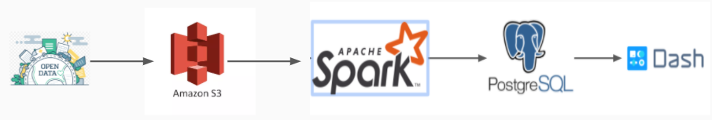
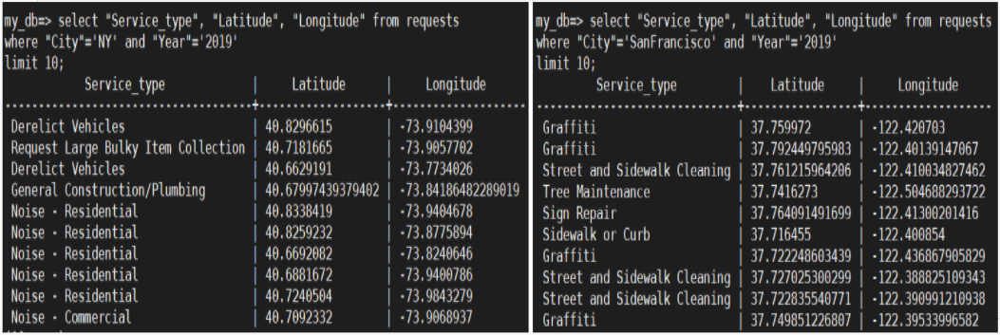
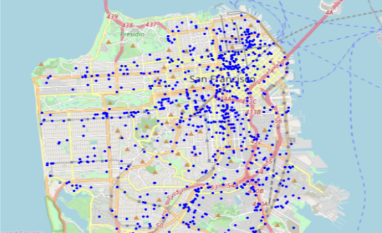
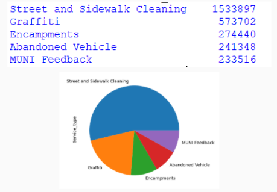
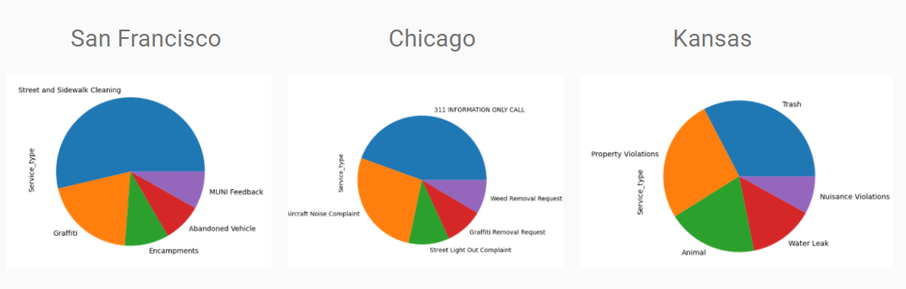

# iReports

This is a project I built while working as Insight Data Engineering Fellow. The project creates a multi-city 311 database and builds an end-to-end data pipeline starting from s3 to ending at Dash front-end.


## Motivation

The 311 is a service which allows citizens to inform government of non-emergency problems or service requests facing their neighborhood. The big challenge for the government agencies is how to prioritize efficient allocation of resources.Building a nationwide 311 database can be of great use to address this problem. It will not only allow the government agencies to allocate resources efficiently but also help make them long term data driven decisions and serve people better. 


## Datasets

I have collected data from ten cities - The data is obtained from the official Open data web pages of the cities. The combined data is about 20 GB in size and has over 30 million rows.


## Architecture 

For this project I used S3 for storing collected data, Apache Spark for processing, Postgres to build the database and Plotly Dash for visualization. All of them are hosted on AWS EC2 instances.  



## Data-Processing 

The cleaning and processing is performed in Apache Spark. First of all, data is imported from s3 bucket to Spark dataframes.It is then cleaned by removing all null values. A fixed normalized schema is choosen, that is used to extract the relevant columns from each data set. Values such as Month and Year are extracted from timestamp, and after further processing which involves renaming columns, the data is stacked together row-wise. The data is then written to Postgres table from which it can be easily queried upon:




## Data Visualization

The data from PostgreSQL is imported to a front-end Dash application by using a python driver for postgres, "Psycopg2". After establishing the connection, the relevant quantities are exported which are to be plotted in the Dash application. For Visualization, I focus on San Francisco city, and use the latitude and longitude information to plot the map of Service requests:



Furthermore, I perform some simple aggregation for visualizing the top 5 requests



I then futher compare the service requests from different location by visualizing top service requests from three different cities:




## Web App Instructions 

Edit the last line in `dash/dash_app.py` to server the app over local or ec2 pg instance and launch the web app with 
```
python app/app.py 
```
and browse to 
```
http://127.0.0.1:80/
or
http://ec2-13-58-63-79.us-east-2.compute.amazonaws.com
Default port:80
```
